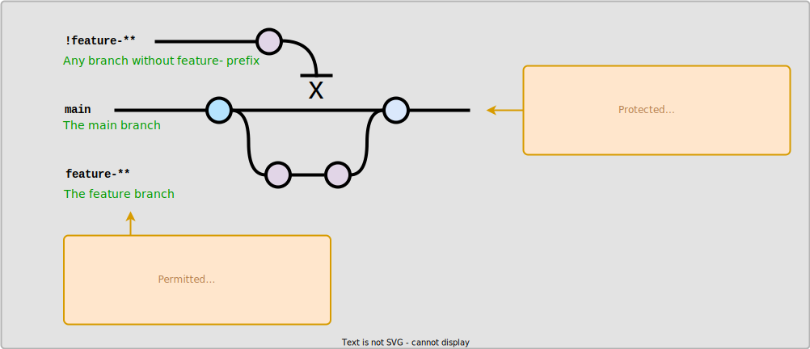

# Basic CI Project

This repository was created to practice building a basic CI pipeline with GitHub Actions, Gradle, Java and Docker.

## How it works
### Feature workflow

Branches created with a name starting with `feature-` trigger the GitHub Actions feature workflow (see `basic-ci-feature-workflow.yml`).
1. Request a runner with Ubuntu
2. Set up Java
3. Validate Gradle wrapper 
2. Build application, run all tests and build scan 
3. Upload Gradle build reports and attach as artifact to action 
4. Upload Jacoco test coverage reports and attach as artifact to action 
5. Create Docker image and upload to DockerHub

Docker images are named automatically: `feature-{name}-v{github.run_number}`.

### Main/release workflow

Only branches with the `feature-` prefix are permitted to push to main. Changes to main trigger workflow `basic-ci-workflow.yml`.
1. Request a runner with Ubuntu, set up Java, and validate Gradle wrapper 
2. Request a runner with Ubuntu
2. Set up Java
3. Validate Gradle wrapper
2. Build application, run all tests and build scan
3. Create Docker image and upload to DockerHub 
4. Create a release on GitHub
5. Use content of `latest_release_notes.txt` as release notes body

Docker images are named automatically: `main-v{github.run_number}`. Release is named `v{github.run_number}`.

### Branch protection
